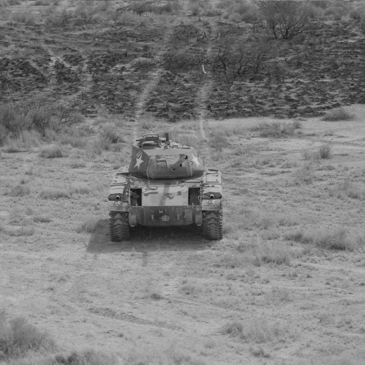
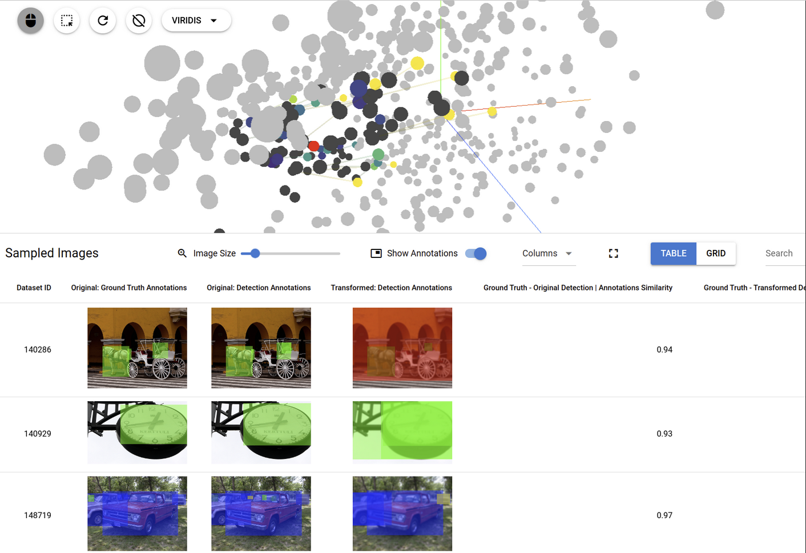

<hr/>

<!-- :auto badges: -->
[](https://pypi.org/project/nrtk/)

[](https://nrtk.readthedocs.io/en/latest/?badge=latest)
<!-- :auto badges: -->

# Natural Robustness Toolkit (NRTK)

>The Natural Robustness Toolkit (NRTK) is an open source toolkit for generating operationally realistic perturbations to evaluate the natural robustness of computer vision 
 algorithms.

The `nrtk` package evaluates the natural robustness of computer vision algorithms to various perturbations, including sensor-specific changes to camera focal length, aperture
diameter, etc.

We have also created the [`nrtk-jatic`](https://nrtk.readthedocs.io/en/latest/interoperability.html) module to support AI T&E
use cases and workflows, through interoperability with the [`maite`](https://github.com/mit-ll-ai-technology/maite)
library and integration with other [JATIC](https://cdao.pages.jatic.net/public/) tools. Users seeking to use NRTK to
perturb MAITE-wrapped datasets or evaluate MAITE-wrapped models should
start with the `nrtk-jatic` module.

## Why NRTK?

NRTK addresses the critical gap in evaluating computer vision model resilience to real-world operational conditions beyond what traditional image augmentation libraries cover. T&E engineers need precise methods to assess how models respond to sensor-specific variables (focal length, aperture diameter, pixel pitch) and environmental factors without the prohibitive costs of exhaustive data collection. NRTK leverages pyBSM's physics-based models to rigorously simulate how imaging sensors capture and process light, enabling systematic robustness testing across parameter sweeps, identification of performance boundaries, and visualization of model degradation. This capability is particularly valuable for satellite and aerial imaging applications, where engineers can simulate hypothetical sensor configurations to support cost-performance trade-off analysis during system design—ensuring AI models maintain reliability when deployed on actual hardware facing natural perturbations in the field.

## Target Audience
This toolkit is intended to help data scientists, developers, and T&E engineers who want to rigorously evaluate and enhance the robustness of their computer vision models. For users of the JATIC product suite, this toolkit is used to assess model robustness against natural perturbations. 


<!-- :auto installation: -->
## Installation
`nrtk` installation has been tested on Unix and Linux systems.

To install the current version via `pip`:
```bash
pip install nrtk[<extra1>,<extra2>,...]
```

To install the current version via `conda-forge`:
```bash
conda install -c conda-forge nrtk
```

Certain plugins may require additional runtime dependencies. Details on these requirements can be found
[here](https://nrtk.readthedocs.io/en/latest/implementations.html).

For more detailed installation instructions, visit the
[installation documentation](https://nrtk.readthedocs.io/en/latest/installation.html).
<!-- :auto installation: -->

<!-- :auto getting-started: -->
## Getting Started
Explore usage examples of the `nrtk` package in various contexts using the Jupyter notebooks provided in the
`./docs/examples/` directory.
<!-- :auto getting-started: -->

## Example: A First Look at NRTK Perturbations

Via the pyBSM package, NRTK exposes a large set of Optical Transfer Functions (OTFs). These OTFs can simulate different
environmental and sensor-based effects. For example, the :ref:`JitterOTFPerturber <JitterOTFPerturber>` simulates
different levels of sensor jitter. By modifying its input parameters, you can observe how sensor jitter affects image
quality.


#### Input Image

Below is an example of an input image that will undergo a Jitter OTF perturbation. This image represents the initial state before any transformation.

  


#### Code Sample

Below is some example code that applies a Jitter OTF transformation::

    from nrtk.impls.perturb_image.pybsm.jitter_otf_perturber import JitterOTFPerturber
    import numpy as np
    from PIL import Image

    INPUT_IMG_FILE = 'docs/images/input.jpg'
    image = np.array(Image.open(INPUT_IMG_FILE))

    otf = JitterOTFPerturber(sx=8e-6, sy=8e-6, name="test_name")
    out_image = otf.perturb(image)

This code uses default values and provides a sample input image. However, you can adjust
the parameters and use your own image to visualize the perturbation. The sx and sy parameters
(the root-mean-squared jitter amplitudes in radians, in the x and y directions) are
the primary way to customize a jitter perturber. Larger jitter amplitude generate a
larger Gaussian blur kernel.

#### Resulting Image

The output image below shows the effects of the Jitter OTF on the original input. This result illustrates the Gaussian
blur introduced due to simulated sensor jitter.

  


<!-- :auto documentation: -->
## Documentation
Documentation for both release snapshots and the latest main branch is available on
[ReadTheDocs](https://nrtk.readthedocs.io/en/latest/).

To build the Sphinx-based documentation locally for the latest reference:
```bash
# Install dependencies
poetry install --sync --with main,linting,tests,docs
# Navigate to the documentation root
cd docs
# Build the documentation
poetry run make html
# Open the generated documentation in your browser
firefox _build/html/index.html
```
<!-- :auto documentation: -->


<!-- :auto contributing: -->
## Contributing
Contributions are encouraged!

The following points help ensure contributions follow development practices.

- Follow the [JATIC Design Principles](https://cdao.pages.jatic.net/public/program/design-principles/).
- Adopt the Git Flow branching strategy.
- Detailed release information is available in [docs/release_process.rst](./docs/release_process.rst).
- Additional contribution guidelines and issue reporting steps can be found in [CONTRIBUTING.md](./CONTRIBUTING.md).
<!-- :auto contributing: -->

<!-- :auto developer-tools: -->
### Developer Tools

Ensure the source tree is acquired locally before proceeding.

#### Poetry Install

You can install using [Poetry](https://python-poetry.org/):

> [!IMPORTANT]
> NRTK currently requires `poetry<2.0`

> [!WARNING]
> Users unfamiliar with Poetry should use caution. See
> [installation documentation](https://nrtk.readthedocs.io/en/latest/installation.html#from-source) for more
> information.

```bash
poetry install --with main,linting,tests,docs --extras "<extra1> <extra2> ..."
```

#### Pre-commit Hooks
Pre-commit hooks ensure that code complies with required linting and formatting guidelines. These hooks run
automatically before commits but can also be executed manually. To bypass checks during a commit, use the `--no-verify`
flag.

To install and use pre-commit hooks:
```bash
# Install required dependencies
poetry install --sync --with main,linting,tests,docs
# Initialize pre-commit hooks for the repository
poetry run pre-commit install
# Run pre-commit checks on all files
poetry run pre-commit run --all-files
```
<!-- :auto developer-tools: -->

## NRTK Demonstration Tool
This [associated project](https://github.com/Kitware/nrtk-explorer)
provides a local web application that provides a demonstration of visual
saliency generation in a user interface.
This provides an example of how image perturbation, as generated by this package,
can be utilized in a user interface to facilitate dataset exploration.
This tool uses the [trame framework](https://kitware.github.io/trame/).




<!-- :auto license: -->
## License
[Apache 2.0](./LICENSE)
<!-- :auto license: -->

<!-- :auto contacts: -->
## Contacts

**Principal Investigator / Product Owner**: Brian Hu (Kitware) @brian.hu

**Scrum Master / Maintainer**: Brandon RichardWebster (Kitware) @b.richardwebster

**Deputy Scrum Master / Maintainer**: Emily Veenhuis (Kitware) @emily.veenhuis

**Project Manager**: Keith Fieldhouse (Kitware) @keith.fieldhouse

**Program Representative**: Austin Whitesell (MITRE) @awhitesell
<!-- :auto contacts: -->

<!-- :auto acknowledgment: -->
Acknowledgment
--------------

This material is based upon work supported by the Chief Digital and Artificial Intelligence Office under Contract No.
519TC-23-9-2032. The views and conclusions contained herein are those of the author(s) and should not be interpreted as
necessarily representing the official policies or endorsements, either expressed or implied, of the U.S. Government.
<!-- :auto acknowledgment: -->
