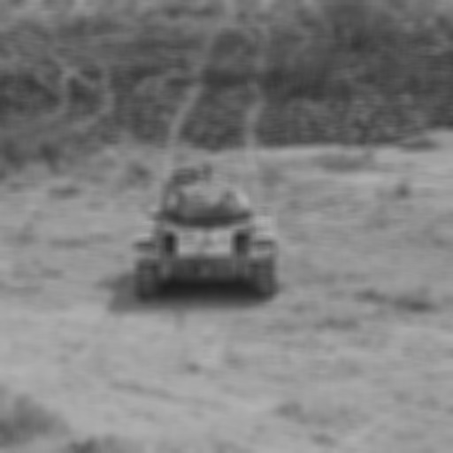

Getting Started with NRTK
=========================

Overview
--------

NRTK consists of three main parts:

- Image Perturbation:

  The core of NRTK is based on image perturbation. NRTK offers a wide variety of ways to perturb images and transform
  bounding boxes. The perturbation classes take an image and perform a transformation based on input parameters.
  `Perturbers <implementations.html#image-perturbation>`_
  implement the `PerturbImage <interfaces.html#interface-perturbimage>`_ interface.

- Perturbation Factories:

  Building upon image perturbation, perturbation factories are able to take a range of
  values for parameter(s) and perform multiple perturbations on the same image. This allows for quick and simple
  generation of multiple perturbations.  `Perturbation Factories <implementations.html#perturbation-factory>`_
  implement the `PerturbImageFactory <interfaces.html#interface-perturbimagefactory>`_ interface.

- Model Evaluation:

  NRTK provides functionality for evaluating models in the image classification and object
  detection tasks. The package also provides test orchestration functionality for performing evaluations over a sweep
  of parameters in order to test model response to varying severity of image degradation. While NRTK perturbations can
  be used with any evaluation harness, built-in
  `NRTK Generators <implementations.html#end-to-end-generation-and-scoring>`_ implement the
  `GenerateObjectDetectorBlackboxResponse <interfaces.html#interface-generateobjectdetectorblackboxresponse>`_
  interface.

In this example, we'll generate your first perturbation. Afterwards, `the NRTK tutorial <examples/nrtk_tutorial.html>`_
provides a deeper look at perturbation and the other main components of NRTK.

Example: A First Look at NRTK Perturbations
-------------------------------------------

Via the pyBSM package, NRTK exposes a large set of Optical Transfer Functions (OTFs). These OTFs can simulate different
environmental and sensor-based effects. For example, the :ref:`JitterOTFPerturber <JitterOTFPerturber>` simulates
different levels of sensor jitter. By modifying its input parameters, you can observe how sensor jitter affects image
quality.

Input Image
^^^^^^^^^^^

Below is an example of an input image that will undergo a Jitter OTF perturbation. This image represents the initial
state before any transformation.

.. figure:: images/input.jpg

   Figure 1: Input image.

Code Sample
^^^^^^^^^^^

Below is some example code that applies a Jitter OTF transformation:

.. code-block:: python

    from nrtk.impls.perturb_image.pybsm.jitter_otf_perturber import JitterOTFPerturber
    import numpy as np
    from PIL import Image

    INPUT_IMG_FILE = 'docs/images/input.jpg'
    image = np.array(Image.open(INPUT_IMG_FILE))

    otf = JitterOTFPerturber(s_x=8e-6, s_y=8e-6)
    out_image = otf.perturb(image)

This code uses default values and provides a sample input image. However, you can adjust
the parameters and use your own image to visualize the perturbation. The ``s_x`` and ``s_y`` parameters
(the root-mean-squared jitter amplitudes in radians, in the x and y directions) are
the primary way to customize a jitter perturber. Larger jitter amplitude generate a
larger Gaussian blur kernel.

Resulting Image
^^^^^^^^^^^^^^^

The output image below shows the effects of the Jitter OTF on the original input. This result illustrates the Gaussian
blur introduced due to simulated sensor jitter.

   Figure 2: Output image.

Next Steps
----------

For broader context or foundational theory, see:

- `NRTK Tutorial <examples/nrtk_tutorial.html>`__ – Step-by-step tutorial to get started
- :doc:`nrtk_explanation` – Conceptual guide to NRTK’s architecture and approach
- :doc:`risk_factors` – Conceptual guide to understand how NRTK's perturbations map to real-world risk factors
