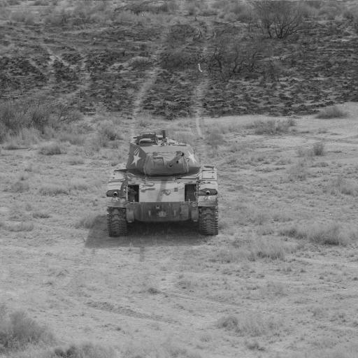
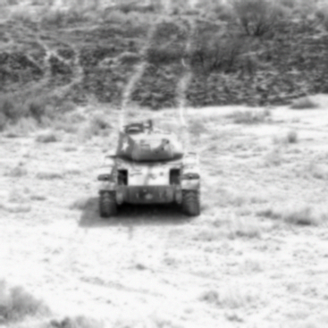
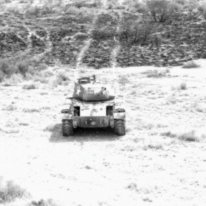

Getting Started
===============

Note: If you need to install NRTK, see :ref:`Installation`.

NRTK consists of three main parts:

#. :ref:`Image Perturbation`
#. :ref:`Perturbation Factories`
#. :ref:`Model Evaluation`

The following sections will guide you through setting up and using an example perturber.

Image Perturbation
^^^^^^^^^^^^^^^^^^

The core of NRTK is based on image perturbation. NRTK offers a wide variety of ways to perturb
images. `scikit-image <https://scikit-image.org/>`_, `Pillow <https://pillow.readthedocs.io/en/stable/>`_,
`openCV <https://pypi.org/project/opencv-python/#documentation-for-opencv-python>`_, and
`pyBSM  <https://gitlab.jatic.net/jatic/kitware/pybsm>`_ are used for various types of perturbation. The
perturbation classes take an image and perform a transformation based on input parameters. The examples
shown below focus on a ``pyBSM`` based perturber. To see examples of other perturbations, the
`perturbers <https://gitlab.jatic.net/jatic/kitware/nrtk/-/blob/main/examples/perturbers.ipynb?ref_type=heads>`_
notebook shows initialization and use of ``scikit-image``, ``Pillow``, and ``openCV`` perturbers.

For this example, we are going to use the :ref:`PybsmPerturber <PybsmPerturber>` from ``pyBSM``. This
perturber is useful for creating new images based on existing parameters. The
:ref:`PybsmSensor <PybsmSensor>` and :ref:`PybsmScenario <PybsmScenario>` classes contain the
parameters for an existing sensor and environment, respectively.

.. code-block::
  :caption: pyBSM Perturber Initialization

  import numpy as np
  import pybsm
  from nrtk.impls.perturb_image.pybsm.scenario import PybsmScenario
  from nrtk.impls.perturb_image.pybsm.sensor import PybsmSensor
  from nrtk.impls.perturb_image.pybsm.perturber import PybsmPerturber

  opt_trans_wavelengths = np.array([0.58-.08,0.58+.08])*1.0e-6
  f = 4 #telescope focal length (m)
  p = .008e-3  # detector pitch (m)
  sensor = PybsmSensor(
      # required
      name                = 'L32511x',
      D                   = 275e-3, # Telescope diameter (m)
      f = f,
      p_x = p,
      opt_trans_wavelengths = opt_trans_wavelengths, #Optical system transmission, red  band first (m)
      # optional
      optics_transmission = 0.5*np.ones(opt_trans_wavelengths.shape[0]), #guess at the full system optical transmission (excluding obscuration)
      eta                 = 0.4, #guess
      w_x                  = p, #detector width is assumed to be equal to the pitch
      w_y                  = p, #detector width is assumed to be equal to the pitch
      int_time            = 30.0e-3, #integration time (s) - this is a maximum, the actual integration time will be, determined by the well fill percentage
      dark_current        = pybsm.dark_current_from_density(1e-5,p,p), #dark current density of 1 nA/cm2 guess, guess mid range for a silicon camera
      read_noise          = 25.0, #rms read noise (rms electrons)
      max_n               = 96000.0, #maximum ADC level (electrons)
      bitdepth            = 11.9, #bit depth
      max_well_fill       = .6, #maximum allowable well fill (see the paper for the logic behind this)
      sx                  = 0.25*p/f, #jitter (radians) - The Olson paper says that its "good" so we'll guess 1/4 ifov rms
      sy                  = 0.25*p/f, #jitter (radians) - The Olson paper says that its "good" so we'll guess 1/4 ifov rms
      dax                 = 100e-6, #drift (radians/s) - again, we'll guess that it's really good
      day                 = 100e-6, #drift (radians/s) - again, we'll guess that it's really good
      qe_wavelengths       = np.array([.3, .4, .5, .6, .7, .8, .9, 1.0, 1.1])*1.0e-6,
      qe                  = np.array([0.05, 0.6, 0.75, 0.85, .85, .75, .5, .2, 0])
  )

  scenario = PybsmScenario(
          name='niceday',
          ihaze=1, #weather model
          altitude=9000.0, #sensor altitude
          ground_range=0.0, #range to target
          aircraft_speed=100.0
  )

  perturber=PybsmPerturber(sensor=sensor, scenario=scenario, ground_range=10000)

In the example above, we have created a ``pyBSM`` perturber where the output image will have a ground_range of 10000m
instead of 0m. The image below is the original image we will use for future perturbations.

  Original image of a tank

The code block below shows the loading of the image above and the calling of the perturber. It is important
to note that the ground sample distance (or ``img_gsd``) is another parameter the user will have to provide.
The resulting image is displayed below the code block.

.. code-block::
  :caption: pyBSM Perturber Execution

  import cv2

  INPUT_IMG_FILE = './data/M-41 Walker Bulldog (USA) width 319cm height 272cm.tiff'
  image = cv2.imread(INPUT_IMG_FILE)
  img_gsd = 3.19/165.0 #the width of the tank is 319 cm and it spans ~165 pixels in the image

  perturbed_image = perturber.perturb(image, additional_params={'img_gsd': img_gsd})

  Image of a tank with ground range of 10000m.

Any of the parameters in either :ref:`PybsmSensor <PybsmSensor>` or
:ref:`PybsmScenario <PybsmScenario>` can be modified; however, only one parameter can be modified
with one value using the basic perturber. The next section will cover modifying multiple parameters and
multiple values.

Perturbation Factories
^^^^^^^^^^^^^^^^^^^^^^

Building upon image perturbation, perturbation factories are able to take a range of values for parameter(s)
and perform multiple perturbations on the same image. This allows for quick and simple generation of
multiple perturbations. The ``scikit-image``, ``Pillow``, and ``openCV`` perturbers use the
:ref:`StepPerturbImageFactory <StepPerturbImageFactory>` and the ``pyBSM`` perturber uses the :ref:`CustomPybsmPerturbImageFactory <CustomPybsmPerturbImageFactory>`.

Continuing on from the previous example, the snippet below shows the initialization of a
``CustomPybsmPerturbImageFactory``. The ``theta_keys`` variable controls which parameter(s) we are modifying
and ``thetas`` are the actual values of the parameter(s). In this example, we are modifying the
focal length (``f``) with the values of 1, 2, and 3. The modified images are displayed below the
code block.

.. code-block::
  :caption: CustomPybsmPerturbImageFactory Initialization and Execution

  from nrtk.impls.perturb_image_factory.pybsm import CustomPybsmPerturbImageFactory

  focal_length_pf = CustomPybsmPerturbImageFactory(
      sensor=sensor,
      scenario=scenario,
      theta_keys=["f"],
      thetas=[[1, 2, 3]]
  )

  for idx, perturber in enumerate(focal_length_pf):
      perturbed_img = perturber(image, additional_params={'img_gsd': img_gsd})

.. list-table::

  * - .. figure:: images/1_focal_length.png
       :align: center

       Image of a tank with focal length of 1m.

    - .. figure:: images/2_focal_length.png
       :align: center

       Image of a tank with focal length of 2m.

  Image of a tank with focal length of 3m.

Not only can you modify multiple values on one parameter, but you can also modify multiple
parameters at the same time. The code block below shows the focal length and ground range variables being modified. The
resulting images are displayed below the code block.

.. code-block::
  :caption: CustomPybsmPerturbImageFactory with Multiple Parameters

  f_groung_range_pf = CustomPybsmPerturbImageFactory(
      sensor=sensor,
      scenario=scenario,
      theta_keys=["f", "ground_range"],
      thetas=[[1, 2], [10000, 20000]]
  )

  for idx, perturber in enumerate(f_groung_range_pf):
      perturbed_img = perturber(image, additional_params={'img_gsd': img_gsd})

.. list-table::

  * - .. figure:: images/1_focal_10000_ground.png
       :align: center

       Image of a tank with focal length of 1m and ground range of 10000m.

    - .. figure:: images/2_focal_10000_ground.png
       :align: center

       Image of a tank with focal length of 2m and ground range of 10000m.

  * - .. figure:: images/1_focal_20000_ground.png
       :align: center

       Image of a tank with focal length of 1m and ground range of 20000m.

    - .. figure:: images/2_focal_20000_ground.png
       :align: center

       Image of a tank with focal length of 2m and ground range of 20000m.

Model Evaluation
^^^^^^^^^^^^^^^^
NRTK provides functionality for evaluating models in the image classification and object detection
tasks. The package also provides test orchestration functionality for performing evaluations over a
sweep of parameters in order to test model response to varying severity of image degradation.

To see examples of image classification and object detection, the
`coco_scorer <https://gitlab.jatic.net/jatic/kitware/nrtk/-/blob/main/examples/coco_scorer.ipynb?ref_type=heads>`_
notebook from the ``examples`` directory shows different scoring techniques. For examples of model response to image
degradations, there are two notebooks to check out. The
`simple_generic_generator
<https://gitlab.jatic.net/jatic/kitware/nrtk/-/blob/main/examples/simple_generic_generator.ipynb?ref_type=heads>`_
notebook shows model response to image degradation through perturbers based on ``scikit-image``, ``Pillow``, and
``openCV``. The
`simple_pybsm_generator
<https://gitlab.jatic.net/jatic/kitware/nrtk/-/blob/main/examples/simple_pybsm_generator.ipynb?ref_type=heads>`_
notebook shows model response to image degradation through ``pyBSM``-based perturbers.
