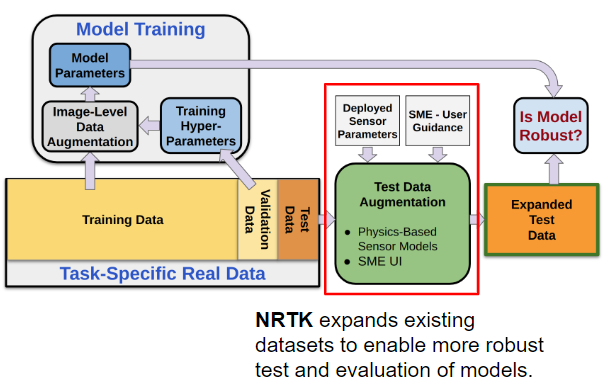

Concepts of Robustness in Computer Vision
=========================================

Computer vision models are highly sensitive to data distribution shifts, which can arise from either:

    * Synthetic image perturbations (e.g., artificially applied noise, blur, or transformations) [1].
    * Naturally occurring variations in real-world data, such as changes in lighting, sensor properties, or
      environmental conditions [2].

The Challenge of Robustness Testing
-----------------------------------

The gold standard for evaluating AI model robustness is to test against diverse real-world datasets that fully cover the
expected range of deployment conditions. However:

    * Collecting exhaustive test data is prohibitively expensive and, in some cases, impossible.
    * Many critical conditions (e.g. varying sensor properties) cannot be easily captured in real-world datasets.
    * Standard augmentation libraries fall short. Existing image augmentation libraries, such as
      `imgaug <https://github.com/aleju/imgaug>`_ and
      `albumentations <https://github.com/albumentations-team/albumentations>`_, provide useful transformations like
      rotation, scaling, and noise addition, but do not account for the physics-based, sensor-specific perturbations
      that are crucial for evaluating how AI models perform in real-world operational conditions.

How NRTK Helps
^^^^^^^^^^^^^^

The Natural Robustness Toolkit (NRTK) enables principled robustness testing by **augmenting finite test datasets** with
realistic, physics-based perturbations.

This allows AI practitioners to:
    * Simulate real-world variations that would occur due to different imaging conditions.
    * Evaluate AI model performance under conditions that are difficult to replicate with standard data collection.
    * Optimize sensor design for AI-based detection and classification tasks.

   Figure 1: Extending Robustness Testing with NRTK.

Understanding Sensor-Specific Perturbations in AI Robustness
------------------------------------------------------------

NRTK specializes in **sensor-specific perturbations**, enabling more realistic robustness evaluation than standard
augmentations. These perturbations model how changes in imaging sensor parameters affect AI models.

Key Sensor-Based Perturbations
^^^^^^^^^^^^^^^^^^^^^^^^^^^^^^

NRTK can simulate variations in:
    * Focal length – Alters the effective field of view and spatial resolution.
    * Aperture size – Impacts depth of field and light collection.
    * Pixel pitch – Affects sensor resolution and noise characteristics.
    * Quantum efficiency – Determines how efficiently photons are converted to electrical signals.
    * Compression and noise effects – Models artifacts introduced by storage and transmission.

These perturbations are particularly useful in applications where AI performance depends on imaging conditions, such as
**satellite imagery, surveillance, and autonomous systems**.

How NRTK Works: Image Perturbation and Scoring
----------------------------------------------

Image Perturbations
^^^^^^^^^^^^^^^^^^^

NRTK applies controlled image perturbations to assess model robustness. These perturbations are implemented using:
    * Pre-sensor modeling – Adjusts scene parameters before the image is captured.
    * In-sensor effects – Simulates sensor distortions (e.g., noise, blur, quantization).
    * Post-sensor processing – Models compression artifacts and other downstream effects.

NRTK integrates with pyBSM, an open source library that rigorously models radiative transfer and imaging-sensor physics
[3]. This allows for highly realistic perturbations tailored to specific sensor configurations. It also provides
functionality through `Strategy <https://en.wikipedia.org/wiki/Strategy_pattern>`_ and
`Adapter <https://en.wikipedia.org/wiki/Adapter_pattern>`_ patterns to allow for modular integration into systems and
applications.

Scoring and Model Evaluation
^^^^^^^^^^^^^^^^^^^^^^^^^^^^

After perturbing images, NRTK enables evaluation of AI models by:

    * Testing model performance using perturbed datasets.
    * Comparing model outputs across different perturbation settings.
    * Supporting classification and detection tasks in a black-box manner.

By using these techniques, NRTK provides insights into how robust AI models are to real-world sensor variations,
helping teams develop more reliable vision-based AI systems.

In addition to NRTK's built in scoring and model evaluation, NRTK has interoperability with the
`maite <https://github.com/mit-ll-ai-technology/maite>`_ library and integration with other
`JATIC <https://cdao.pages.jatic.net/public/>`_ tools.

NRTK Algorithms
---------------

The NRTK algorithms can be organized according to their respective tasks:

- Image perturbation:
    * :ref:`Image Perturbation <Interface: PerturbImage>`
    * :ref:`Perturbation Factory <Interface: PerturbImageFactory>`

- Score generation:
    * :ref:`Scoring <Interface: ScoreDetections>`
    * :ref:`End-to-End Generation and Scoring <Interface: GenerateObjectDetectorBlackboxResponse>`

- MAITE integration:
    * :ref:`Interoperability`

References
----------

1. Hendrycks, Dan, and Thomas Dietterich. "Benchmarking Neural Network Robustness to Common
Corruptions and Perturbations." International Conference on Learning Representations. 2018.

2. Recht, Benjamin, et al. "Do imagenet classifiers generalize to imagenet?." International
Conference on machine learning. PMLR, 2019.

3. LeMaster, Daniel A., and Michael T. Eismann. 2017. "pyBSM: A Python package for modeling imaging
systems." Proceedings of the SPIE 10204.
