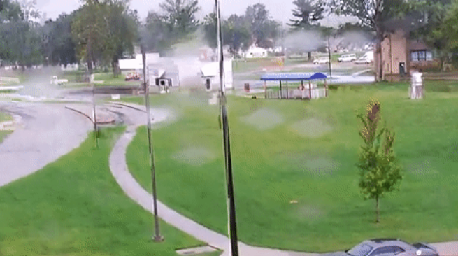

Water Droplets Simulation Module
=================================

Water droplets on camera lenses create localized distortions through refraction, reflection,
and occlusion. These effects can cause missed detections, reduced confidence scores, fragmented
tracking, and corrupted feature extraction — especially when droplets obscure or warp critical
target regions. Because many computer vision models are trained on clear, unobstructed imagery,
water droplets represent a common operational friction that can significantly degrade performance
in outdoor and maritime environments.

From an ML T&E perspective, water droplets matter because they introduce localized distortions
that models rarely encounter during training. Unlike uniform blur or noise, droplets create
irregular distortion patterns in unpredictable locations, which can confuse both detection
and recognition algorithms. This risk is therefore particularly relevant for real-world deployments
where weather conditions cannot be controlled.

NRTK's WaterDropletPerturber simulates this risk using physics-based modeling to create
realistic refraction and blur effects. The perturbation accounts for droplet size, position,
and optical properties to generate operationally representative test conditions for robustness
screening.

Water Droplet Perturbation
---------------------------

Simulates realistic water droplets on a camera lens using physics-based modeling so you can
test how well a model handles refraction, occlusion, and localized distortions.

Use This When...
----------------

* You want to simulate **raindrops or water spray** on camera lenses in outdoor/maritime scenarios.
* You need a **physics-based perturbation** that models realistic optical refraction effects.
* You're doing early **screening of robustness** to lens contamination before running heavier
  T&E analysis (see the full T&E Simulation Guide →
  `WaterDropletPerturber T&E guide <../examples/maite/nrtk_water_droplet_perturber_demo.html>`__).
* You want to test model performance under **localized distortions** rather than global blur.

Minimal Code Example
--------------------

.. code-block:: python

   from nrtk.impls.perturb.environment.water_droplet_perturber import WaterDropletPerturber

   perturber = WaterDropletPerturber(
       num_drops=20,
       size_range=[0.0, 1.0],
       blur_strength=0.25
   )
   perturbed_img, boxes = perturber.perturb(img_in, boxes)

Key Parameters
--------------

* ``num_drops`` - Number of water droplets to simulate on the lens.

  .. list-table::
     :widths: 33 33 33
     :header-rows: 1

     * - Light (20)
       - Medium (50)
       - Heavy (200)
     * - .. image:: ../images/operational_risk_modules/waterdroplet_num_drops_light.png
            :width: 200px
       - .. image:: ../images/operational_risk_modules/waterdroplet_num_drops_medium.png
            :width: 200px
       - .. image:: ../images/operational_risk_modules/waterdroplet_num_drops_heavy.png
            :width: 200px

* ``size_range`` - Range of size multiplier values [min, max] used for computing droplet sizes.

  .. list-table::
     :widths: 33 33 33
     :header-rows: 1

     * - Light ([0.0, 0.5])
       - Medium ([0.5, 1.0])
       - Heavy ([1.0, 1.5])
     * - .. image:: ../images/operational_risk_modules/waterdroplet_size_range_light.png
            :width: 200px
       - .. image:: ../images/operational_risk_modules/waterdroplet_size_range_medium.png
            :width: 200px
       - .. image:: ../images/operational_risk_modules/waterdroplet_size_range_heavy.png
            :width: 200px

* ``blur_strength`` - Strength of Gaussian blur applied to simulate depth-of-field effects.

  .. list-table::
     :widths: 33 33 33
     :header-rows: 1

     * - Light (0.05)
       - Medium (0.5)
       - Heavy (1.0)
     * - .. image:: ../images/operational_risk_modules/waterdroplet_blur_strength_light.png
            :width: 200px
       - .. image:: ../images/operational_risk_modules/waterdroplet_blur_strength_medium.png
            :width: 200px
       - .. image:: ../images/operational_risk_modules/waterdroplet_blur_strength_heavy.png
            :width: 200px

**Advanced Parameters** (defaults work for most cases):

* ``psi`` - Angle between camera line-of-sight and glass plane (radians) - Default: 90°.
* ``n_air`` - Refractive index of air - Default: 1.0.
* ``n_water`` - Refractive index of water - Default: 1.33.
* ``f_x``, ``f_y`` - Camera focal lengths in x and y directions (cm) - Default: 400 for both.
* ``seed`` - Random seed for reproducible results across runs.

Limitations and Next Steps
---------------------------

* API Reference:
  :class:`WaterDropletPerturber<nrtk.impls.perturb.environment.water_droplet_perturber.WaterDropletPerturber>`
* Applies **frame-by-frame** — droplet positions are randomized each call, so there's no
  temporal consistency across video frames (suitable for static image robustness testing).
* Requires optional dependencies: install via ``pip install nrtk[waterdroplet]``.
* See *Validation & Trust* for cross-perturber validation status.
* Related Risks: :ref:`lens-contamination`, :ref:`mist-fog-snow`
