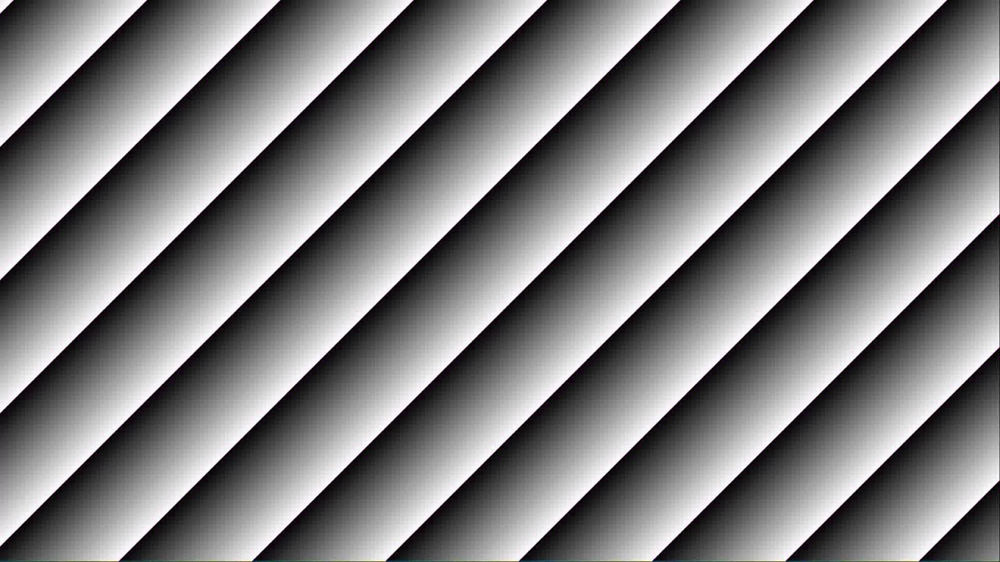

Operational Risk Factors in Computer Vision
===========================================

Operational risk factors in computer vision refer to real-world conditions and system-level variables that can degrade
the performance of vision algorithms once deployed.
These risks can stem from environmental conditions, sensor limitations, data mismatches, or system integration
challenges.

The following table provides a summary of risk factors. Where applicable, a T&E guide providing a detailed example is
listed as well as functionality from NRTK that can be used to simulate the operational risk.

Some of these perturbation functions are not implemented in NRTK directly but can be simulated using the
:doc:`Albumentations perturber <_implementations/nrtk.impls.perturb.wrapper.albumentations_perturber>` which
provides a wrapper around functionality of the `Albumentations <https://albumentations.ai/>`__ library.
Some of the risk factors listed don't have any associated functionality or documentation in NRTK but may be covered in
the future.

Interactive Risk Matrix
-----------------------

.. csv-table::
       :header-rows: 1
       :class: sphinx-datatable
       :name: subset-example

       "Operational Risk","NRTK Perturbation(s)","Key Parameters","severity","dropdown"
       ":ref:`High Frequency Vibration <high-frequency-vibration>` ","JitterOTF","amplitudes","high","Optical"
       ":ref:`Target Out of Focus <target-out-of-focus>`","DefocusOTF","strength","low","Optical"
       ":ref:`Noise and Resolution <noise-and-resolution>`","pyBSM","sensor, scenario","high","Optical"
       ":ref:`Lens Water Droplet <lens-water-droplet>`","WaterDroplet","strength, size, num_of_droplets","low","Environmental"
       ":ref:`Extreme Illumination <extreme-illumination>`","Brightness","factor","low","Environmental"
       ":ref:`Mist, Fog, or Snow  <mist-fog-snow>`","Haze","factor, depth_map","low","Environmental"
       ":ref:`Turbulence <turbulence>`","TurbulenceApertureOTF","sensor, scenario","high","Optical"
       ":ref:`Radial Distortion  <radial-distortion>`","RadialDistortion","coefficients","high","Optical"

.. _high-frequency-vibration:

High-Frequency Vibration
------------------------

Vibrations, such as wind, in the sensor platform induce jitter and blurring.

+-------------------------+------------------------------------------------------------------------------+
| **Impact**              | Reduced effective resolution, frame-to-frame tracking performance.           |
+-------------------------+------------------------------------------------------------------------------+
| **Root Cause**          | Sensor                                                                       |
+-------------------------+------------------------------------------------------------------------------+
| **Affected Domains**    | Ground, Sea                                                                  |
+-------------------------+------------------------------------------------------------------------------+

  mevadata.org

.. _target-out-of-focus:

Target Out of Focus
-------------------

Target is out of focus (due to sensor optics settings, rather than atmospheric / environmental issues.)

+-------------------------+----------------------------------------------------------------------------------+
| **Impact**              | Model may underperform in proportion to loss of resolution w.r.t. training data. |
+-------------------------+----------------------------------------------------------------------------------+
| **Root Cause**          | Sensor                                                                           |
+-------------------------+----------------------------------------------------------------------------------+
| **Affected Domains**    | Ground, Sea                                                                      |
+-------------------------+----------------------------------------------------------------------------------+

  mevadata.org

.. _noise-and-resolution:

Sensor Noise
------------

The sensor data exhibits noise as a result of poor lighting, high ISO settings or overheating.

+-------------------------+----------------------------------------------------------------------------------+
| **Impact**              | Model may underperform in proportion to density of noise in image data.          |
+-------------------------+----------------------------------------------------------------------------------+
| **Root Cause**          | Sensor                                                                           |
+-------------------------+----------------------------------------------------------------------------------+
| **Affected Domains**    | Ground, Sea                                                                      |
+-------------------------+----------------------------------------------------------------------------------+

No sample available.

.. _lens-contamination:

Dirt / Specularities on Lens
----------------------------

Obscurations on lens cover; IR may cause reflections or highlight imperfections in PTZ dome.

+-------------------------+--------------------------------------------------------------------------------------------------+
| **Impact**              | Obscured or out-of-focus image regions; specularities may confuse algorithms.                    |
+-------------------------+--------------------------------------------------------------------------------------------------+
| **Root Cause**          | Sensor                                                                                           |
+-------------------------+--------------------------------------------------------------------------------------------------+
| **Affected Domains**    | Ground, Sea                                                                                      |
+-------------------------+--------------------------------------------------------------------------------------------------+

  mevadata.org

.. _lens-water-droplet:

Water Droplets on Lens
----------------------

Droplets on the lens caused by rain or other factors can obscure or blur parts of the image.

+-------------------------+--------------------------------------------------------------------------------------------------+
| **Impact**              | Obscured or out-of-focus image regions; specularities may confuse algorithms.                    |
+-------------------------+--------------------------------------------------------------------------------------------------+
| **Root Cause**          | Sensor                                                                                           |
+-------------------------+--------------------------------------------------------------------------------------------------+
| **Affected Domains**    | Ground, Sea                                                                                      |
+-------------------------+--------------------------------------------------------------------------------------------------+

.. figure:: images/risks/droplets-2.png
  :width: 500px

  mevadata.org

.. _extreme-illumination:

Extreme (Low / High) Illumination
---------------------------------

Lighting conditions and camera settings result in excessive or insufficient illumination.

+-------------------------+--------------------------------------------------------------------------------------------------+
| **Impact**              | Image has low contrast or dynamic range, reducing usefulness.                                    |
+-------------------------+--------------------------------------------------------------------------------------------------+
| **Root Cause**          | Target                                                                                           |
+-------------------------+--------------------------------------------------------------------------------------------------+
| **Affected Domains**    | All                                                                                              |
+-------------------------+--------------------------------------------------------------------------------------------------+

  doers-brc@kitware.com

  doers-brc@kitware.com

.. _look-angle-variation:

Look Angle Different from Training Data
---------------------------------------

Operational viewpoint differs from those in training data.

+-------------------------+--------------------------------------------------------------------------------------------------+
| **Impact**              | Model performance degrades due to lack of viewpoint coverage.                                    |
+-------------------------+--------------------------------------------------------------------------------------------------+
| **Root Cause**          | Inferencing                                                                                      |
+-------------------------+--------------------------------------------------------------------------------------------------+
| **Affected Domains**    | UAV, WAMI, Satellite                                                                             |
+-------------------------+--------------------------------------------------------------------------------------------------+

No sample available.

.. _shadows:

Shadows
-------

Strong shadows are cast in the target area due to direct illumination.

+-------------------------+--------------------------------------------------------------------------------------------------+
| **Impact**              | Features of interest in shadows may be undetectable.                                             |
+-------------------------+--------------------------------------------------------------------------------------------------+
| **Root Cause**          | Target                                                                                           |
+-------------------------+--------------------------------------------------------------------------------------------------+
| **Affected Domains**    | All                                                                                              |
+-------------------------+--------------------------------------------------------------------------------------------------+

  mevadata.org

.. _mist-fog-snow:

Mist / Fog / Snow
-----------------

.. toctree::
   :hidden:
   :maxdepth: 3

   operational_risk_modules/haze

Reduced visibility conditions such as fog, mist, or blowing snow decrease contrast and obscure scene details.
These effects commonly degrade computer-vision performance in outdoor environments by making targets harder to
distinguish from the background.

+---------------------------+--------------------------------------------------------------------------------------------------+
| **Impact of Risk Factor** | Lower contrast and partial occlusion of features.                                                |
+---------------------------+--------------------------------------------------------------------------------------------------+
| **Root Cause**            | Optical Path                                                                                     |
+---------------------------+--------------------------------------------------------------------------------------------------+
| **Affected Domains**      | Ground, Sea                                                                                      |
+---------------------------+--------------------------------------------------------------------------------------------------+
| **Learn More**            | :doc:`operational_risk_modules/haze`                                                             |
+---------------------------+--------------------------------------------------------------------------------------------------+

  *Source: mevadata.org*

.. _clouds:

Clouds
------

Clouds obscure targets, and may be transient or unpredictable.

+-------------------------+--------------------------------------------------------------------------------------------------+
| **Impact**              | Targets not visible or have reduced contrast.                                                    |
+-------------------------+--------------------------------------------------------------------------------------------------+
| **Root Cause**          | Optic Path                                                                                       |
+-------------------------+--------------------------------------------------------------------------------------------------+
| **Affected Domains**    | UAV, WAMI, Satellite                                                                             |
+-------------------------+--------------------------------------------------------------------------------------------------+

.. figure:: images/risks/clouds.gif
  :width: 500px

  viratdata.org

.. _metadata-incorrect:

Metadata Incorrect
------------------

Metadata stream is out of sync or contains incorrect values.

+-------------------------+--------------------------------------------------------------------------------------------------+
| **Impact**              | Algorithms may use incorrect models or misinterpret data.                                        |
+-------------------------+--------------------------------------------------------------------------------------------------+
| **Root Cause**          | Labeling / Operating input                                                                       |
+-------------------------+--------------------------------------------------------------------------------------------------+
| **Affected Domains**    | All                                                                                              |
+-------------------------+--------------------------------------------------------------------------------------------------+

No sample available.

.. _burned-in-metadata:

Burned-in Metadata
------------------

Metadata is overlaid directly on pixels instead of provided separately.

+-------------------------+--------------------------------------------------------------------------------------------------+
| **Impact**              | Obscures target pixels and confuses detection or stabilization algorithms.                       |
+-------------------------+--------------------------------------------------------------------------------------------------+
| **Root Cause**          | Sensor                                                                                           |
+-------------------------+--------------------------------------------------------------------------------------------------+
| **Affected Domains**    | All                                                                                              |
+-------------------------+--------------------------------------------------------------------------------------------------+

  Example UAV frame from FFMPEG project

.. _video-codec-artifacts:

Video Codec Artifacts
---------------------

Compression errors from overloaded camera processors or poor settings.

+-------------------------+--------------------------------------------------------------------------------------------------+
| **Impact**              | Visual glitches such as smearing or pixel corruption.                                            |
+-------------------------+--------------------------------------------------------------------------------------------------+
| **Root Cause**          | Inter-frame                                                                                      |
+-------------------------+--------------------------------------------------------------------------------------------------+
| **Affected Domains**    | Ground, Sea, UAV                                                                                 |
+-------------------------+--------------------------------------------------------------------------------------------------+

  mevadata.org

.. _video-feed-failures:

Video Feed Failures
-------------------

Hardware or transmission issues interrupt video feed.

+-------------------------+--------------------------------------------------------------------------------------------------+
| **Impact**              | Causes disruption of object tracking or pipeline shutdown.                                       |
+-------------------------+--------------------------------------------------------------------------------------------------+
| **Root Cause**          | Inter-frame                                                                                      |
+-------------------------+--------------------------------------------------------------------------------------------------+
| **Affected Domains**    | Ground, Sea, UAV                                                                                 |
+-------------------------+--------------------------------------------------------------------------------------------------+

  Camera overheating, doers-brc@kitware.com

.. _unstable-frame-rates:

Unstable Frame Rates
--------------------

Feed is encoded at inconsistent rates, often due to overload.

+-------------------------+--------------------------------------------------------------------------------------------------+
| **Impact**              | May drop or duplicate frames, confusing motion-based algorithms.                                 |
+-------------------------+--------------------------------------------------------------------------------------------------+
| **Root Cause**          | Inter-frame                                                                                      |
+-------------------------+--------------------------------------------------------------------------------------------------+
| **Affected Domains**    | Ground, Sea, UAV                                                                                 |
+-------------------------+--------------------------------------------------------------------------------------------------+

  mevadata.org

.. _glint-glare:

Glint / Glare
-------------

Bright reflections due to lighting, target materials, or angles.

+-------------------------+--------------------------------------------------------------------------------------------------+
| **Impact**              | Can obscure targets and skew autoexposure or detection.                                          |
+-------------------------+--------------------------------------------------------------------------------------------------+
| **Root Cause**          | Target                                                                                           |
+-------------------------+--------------------------------------------------------------------------------------------------+
| **Affected Domains**    | All                                                                                              |
+-------------------------+--------------------------------------------------------------------------------------------------+

  "A data set for airborne maritime surveillance environments",
  Ribeiro et al., IEEE Trans. Circuits & Systems for Video Technology, 2017

.. _night-mode:

Night Mode / Low-Light Behavior
-------------------------------

In low light, camera may switch to monochrome or different capture mode.

+-------------------------+--------------------------------------------------------------------------------------------------+
| **Impact**              | Color data lost; resolution may be reduced slightly.                                             |
+-------------------------+--------------------------------------------------------------------------------------------------+
| **Root Cause**          | Sensor                                                                                           |
+-------------------------+--------------------------------------------------------------------------------------------------+
| **Affected Domains**    | Ground, Sea                                                                                      |
+-------------------------+--------------------------------------------------------------------------------------------------+

  mevadata.org

  mevadata.org

.. _turbulence:

Atmospheric Turbulence
-----------------------

Localized distortion due to atmospheric conditions.

+-------------------------+--------------------------------------------------------------------------------------------------+
| **Impact**              | Object detection or tracking may degrade.                                                        |
+-------------------------+--------------------------------------------------------------------------------------------------+
| **Root Cause**          | Optic Path                                                                                       |
+-------------------------+--------------------------------------------------------------------------------------------------+
| **Affected Domains**    | Ground, Sea, UAV                                                                                 |
+-------------------------+--------------------------------------------------------------------------------------------------+

.. figure:: images/risks/turbulence.gif
  :width: 500px

  doers-brc@kitware.com

.. _shot-boundary:

Shot Boundary
-------------

Sudden camera motion creates a new view, invalidating prior context.

+-------------------------+--------------------------------------------------------------------------------------------------+
| **Impact**              | Detectors and trackers need to restart.                                                          |
+-------------------------+--------------------------------------------------------------------------------------------------+
| **Root Cause**          | Inter-frame                                                                                      |
+-------------------------+--------------------------------------------------------------------------------------------------+
| **Affected Domains**    | Ground, Sea                                                                                      |
+-------------------------+--------------------------------------------------------------------------------------------------+

.. figure:: images/risks/shot-boundary.gif
  :width: 500px

  mevadata.org

.. _radial-distortion:

Radial Distortion / Fisheye Artifacts
-------------------------------------

Wide-angle lenses cause distortion at the image periphery.

+-------------------------+--------------------------------------------------------------------------------------------------+
| **Impact**              | Alters appearance and trajectory of objects.                                                     |
+-------------------------+--------------------------------------------------------------------------------------------------+
| **Root Cause**          | Sensor                                                                                           |
+-------------------------+--------------------------------------------------------------------------------------------------+
| **Affected Domains**    | Ground, Sea                                                                                      |
+-------------------------+--------------------------------------------------------------------------------------------------+

  mevadata.org
